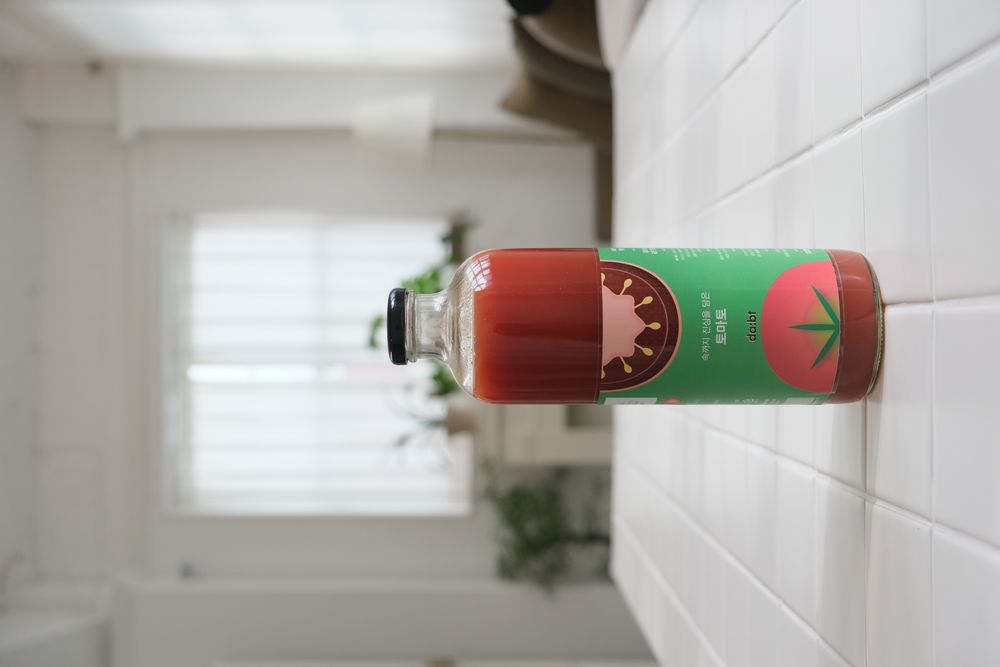
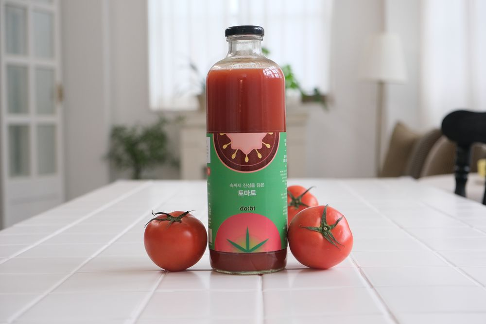
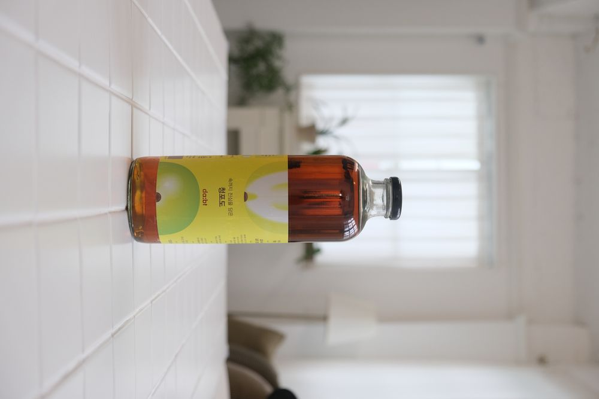

# da:bt 세부 판매 페이지(Sales Page) 최종 기술 스펙

본 문서는 `products.html`에서 각 카테고리를 클릭했을 때 진입하는 개별 제품 판매 페이지의 레이아웃 스펙입니다. 기존 스타일과 충돌을 방지하기 위해 단독 CSS 파일(`sales.css`)을 사용하는 구조로 설계되었습니다.

---

## 1. 주요 레이아웃 및 화면 확장 규칙

1. **화면 비율:** 좌측 제품 설명 영역(**27%**) : 우측 제품 격자 영역(**73%**)의 고정 분할 비율을 유지합니다.
2. **배경색:** 좌측 설명 영역은 원래 와이어프레임의 회색을 제외하고 **순수 흰색(#FFFFFF)**으로 구현합니다.
3. **우측 격자판 무한 확장 규칙:** * 상품이 9개를 초과하여 늘어나면 격자판이 아래로 계속 생성되며 늘어납니다.
   * 이때, **왼쪽 설명 영역(Sidebar)은 화면에 그대로 고정**되어 움직이지 않고, **오른쪽 격자판 영역 내부에서만 부드럽게 세로 스크롤**이 일어나도록 설계합니다.
4. **시그니처 콜론(:) 고정:** 우측 격자판의 첫 번째 화면(상단 영역) 교차점 두 곳에 브랜드의 상징인 검은색 점(콜론)을 배치하며, 스크롤을 내려도 콜론의 최초 상대적 좌표 위치는 고정됩니다.

---

## 2. 세부 판매 페이지 HTML 표준 구조 (`juice_sales.html`)

기존 `style.css` 외에 새로 만들 **`sales.css`**가 상단에 함께 연결되어 있습니다.

```html
<!DOCTYPE html>
<html lang="ko">
<head>
  <meta charset="UTF-8">
  <meta name="viewport" content="width=device-width, initial-scale=1.0">
  <title>da:bt — (1) juice</title>
  <link rel="stylesheet" href="style.css">
  <link rel="stylesheet" href="sales.css">
</head>
<body class="sales-page-body">

  <header class="products-header">
    <nav class="products-nav">
      <a href="index.html#hero" class="nav-item">HOME</a>
      <a href="index.html#story" class="nav-item">STORY</a>
      <a href="products.html" class="nav-item active">PRODUCTS</a>
      <a href="#" class="nav-item">CONTENTS</a>
      <a href="#" class="nav-item">ABOUT</a>
    </nav>
  </header>

  <main class="sales-main">
    
    <section class="sales-sidebar">
      <div class="brand-intro-box">
        <h1 class="category-title">(1) juice</h1>
        <p class="category-desc">da:bt의 주스는 본문의 어쩌구 저쩌구 내용을 기술하는 공간입니다.</p>
        <hr class="mid-line">
        <p class="category-desc-secondary">da:bt의 주스는 본문의 어쩌구 저쩌구 부가 설명 공간입니다.</p>
      </div>
    </section>

    <section class="sales-grid-scroll-area">
      <div class="sales-matrix">
        
        <div class="brand-colon colon-position-1">
          <span class="colon-dot"></span>
          <span class="colon-dot"></span>
        </div>
        <div class="brand-colon colon-position-2">
          <span class="colon-dot"></span>
          <span class="colon-dot"></span>
        </div>

        <div class="matrix-cell"><div class="prod-wrap"><div class="prod-info"><span class="prod-name">JUICE ITEM 01</span><span class="prod-price">12,000₩</span></div></div></div>
        <div class="matrix-cell"><div class="prod-wrap"><div class="prod-info"><span class="prod-name">JUICE ITEM 02</span><span class="prod-price">14,000₩</span></div></div></div>
        <div class="matrix-cell"></div> <div class="matrix-cell"></div>
        <div class="matrix-cell"></div>
        <div class="matrix-cell"></div>
        <div class="matrix-cell"></div>
        <div class="matrix-cell"></div>
        <div class="matrix-cell"></div> <div class="matrix-cell"><div class="prod-wrap"><div class="prod-info"><span class="prod-name">JUICE ITEM 10</span><span class="prod-price">15,000₩</span></div></div></div>
        <div class="matrix-cell"></div>
        <div class="matrix-cell"></div>

      </div>
    </section>

  </main>

  <footer class="products-footer">
    © 2026 dabt. all rights reserved.
  </footer>

</body>
</html>